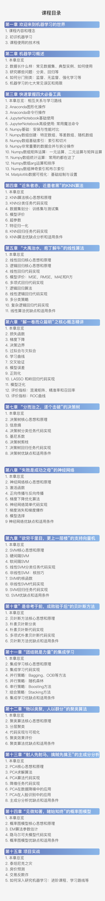

# 《机器学习必修课：经典算法与Python实战》配套代码

## 简介

这是一门与众不同的机器学习课程！它用匪夷所思的视角，灰谐幽默的语言，贴近生活的类比，直观有趣的动画，细致易懂的代码，典型干货的案例，把机器学习最经典的十大算法给你讲的通通透透。

## 相关内容

[B站](https://space.bilibili.com/1921388479) [知乎](https://www.zhihu.com/people/qiu-qiu-27-64-51) [课程链接](https://appmixy0usl5902.h5.xiaoeknow.com)

